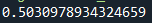
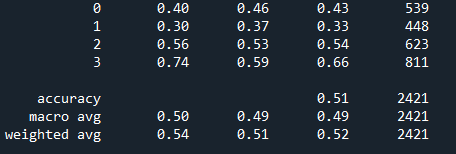
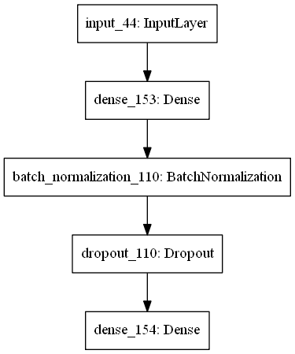
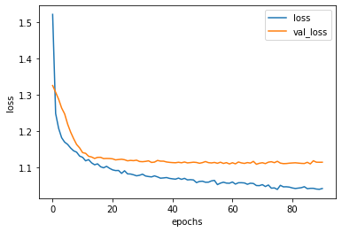
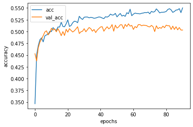

# Segmentation_Prediction
 Prredict customer segmentation based on information given

## Folder
 folder dataset consist train.csv and new_customer.csv 
 
 folder static conain picture of result 
 
## Script
segmentation_class_module.py : contain classes for training model

segmentation_train.py : files for training the dataset 

segmentation_deploy.py : files for deployment

## how to run:
 run segmentation_train
 
 run segmentation_deploy
 
## result accuracy 

## report

## model architecture

## loss and accuracy

